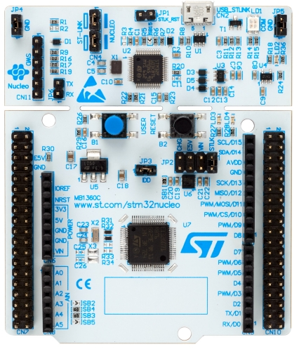
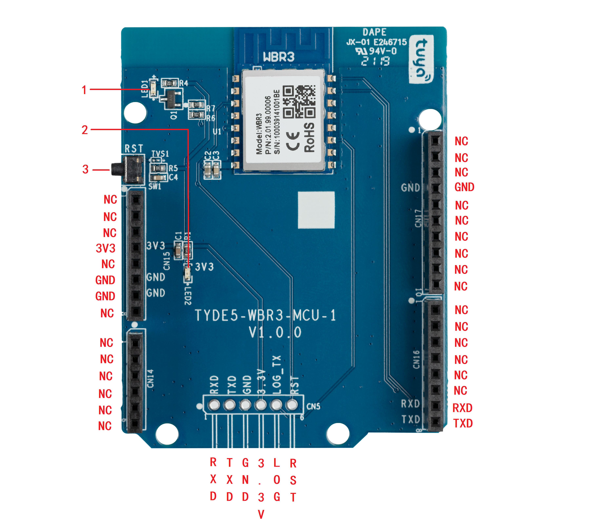
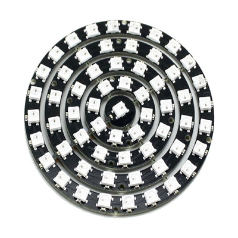
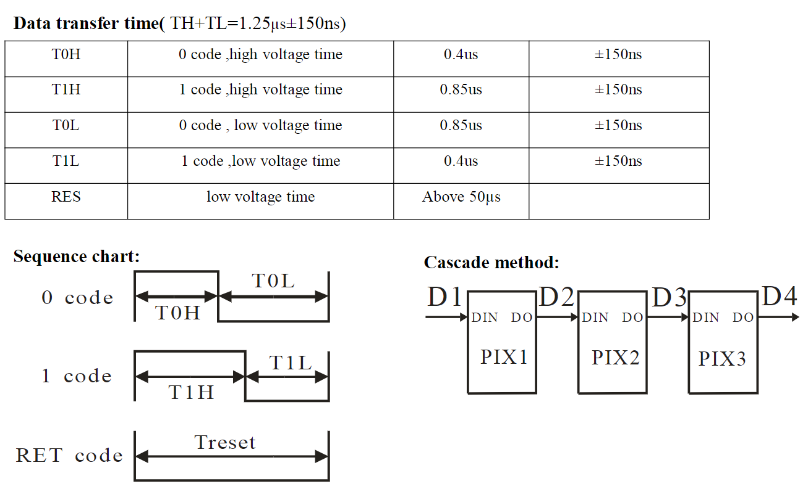
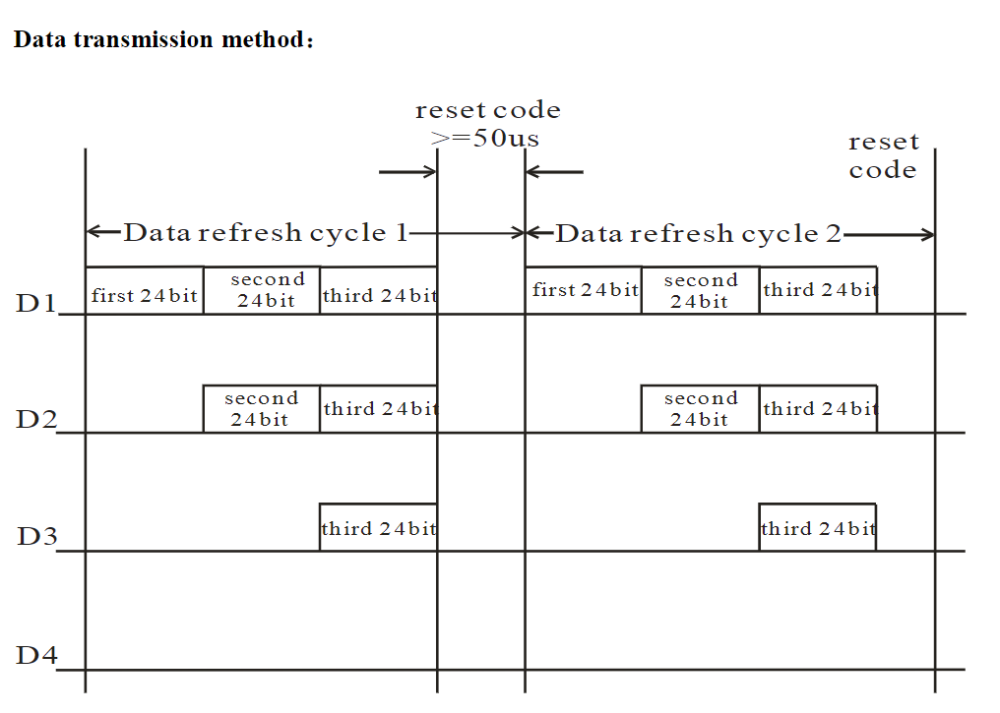
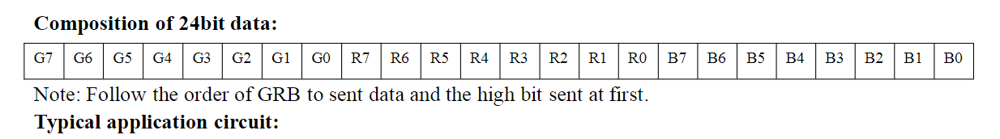
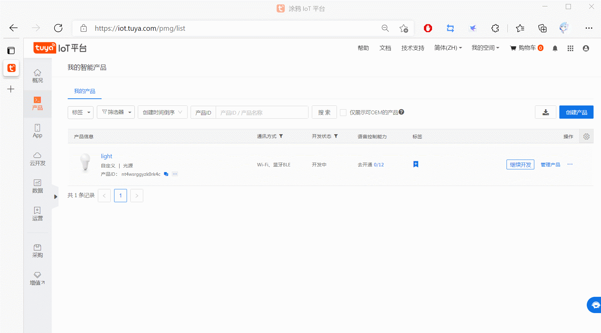
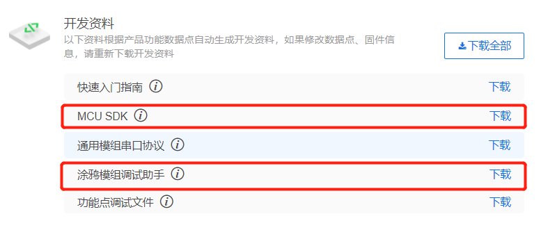

# 炫彩天涯灯

***基于`MCU + WBR3`模组的智能彩灯制作***


## 前期准备

- 准备一个带`UART`的`MCU`核心板子，我这里使用手头上的`STM32G0B1`核心板。

  

- 准备`WBR3`模组，我这里采用涂鸦官方发放的模组板子。

  

- 准备一个`WS2812`彩灯模组，灯的数量自行选择。

  

  

## 基本驱动制作

### `UART`驱动制作

- 我采用`STM32CubeMX`进行开发，只需要配置好波特率等信息，开启UART中断即可。

  ```c
  /*  在UART初始化后添加该行代码 HAL_UART_Receive_IT(&huart1,&huart1_rx,1); 
  	其中 huart1_rx 是用户定义的一个 uint8_t 变量。 */
  HAL_UART_Receive_IT(&huart1,&huart1_rx,1);
  
  /*  在UART中断处理函数中添加该行代码，保证每个数据都能接收
  	HAL_UART_Receive_IT(&huart1,&huart1_rx,1); 
  	下面 1 的代码是后续对接涂鸦模组解析框架需要添加的。 */
  /* 1 */extern void uart_receive_input(unsigned char value);
  void HAL_UART_RxCpltCallback(UART_HandleTypeDef *huart)
  {
      if(huart->Instance == USART1)
      {
          /* 1 */uart_receive_input(huart1_rx);
          HAL_UART_Receive_IT(&huart1,&huart1_rx,1);
      }
      
  }
  ```

### `WS2812`驱动制作

- `WS2812`每个数据`bit`的时间是`1.25us`，复位信号需要低电平大于`50us`，采用`PWM`+`DMA`可以快速实现驱动开发，其他品牌`MCU`也可参考该例子，或者参考网上的例子。

  - 数据`1`和`0`的`bit`电气电平时间定义，以及复位信号电气电平时间定义。

  

  - 多个`WS2812`灯珠串联时的通信示例

  

  - 每个`WS2812`灯珠的颜色数据发送顺序定义，高位在前

  

- 所以我们需要发出一个`1.25us`的`PWM`波，并且占空比可以调节为数据`1`和`0`对应的`bit`电气电平时间。

  - 根据计算，每`50ns`计数一次，共需计数25次即可满足周期为`1.25us`。
  - 技术8次，即为`400ns`；计数17次，即为`850ns`。
  - 所以定时器时钟分频到`20MHz`，自动装载值为25即可满足要求。

- 使用`DMA`来动态更改`PWM`的占空比，每次输出控制`WS2812`只需要启动一次，传入对应的数组即可完成操作。

### 按键驱动

> [`MultiButton`](https://github.com/0x1abin/MultiButton) 是一个小巧简单易用的事件驱动型按键驱动模块，可无限量扩展按键，按键事件的回调异步处理方式可以简化你的程序结构，去除冗余的按键处理硬编码，让你的按键业务逻辑更清晰。

- 本次采用开源的面向对象按键处理框架`MultiButton`，进行按键逻辑处理实现。
- 只需要初始化按键管脚为输入，然后使用`MultiButton`进行初始化配置即可。

```c
Button user_button;
/* 管脚电平获取函数 */
uint8_t user_button_value(void)
{
    return HAL_GPIO_ReadPin(GPIOC,GPIO_PIN_13);
}
/* 按键单击处理函数 */
void user_button_single(void* btn)
{

}
/* 按键双击处理函数 */
void user_button_double(void* btn)
{

}
/* 按键长按处理函数 */
void user_button_long(void* btn)
{

}
/* 按键初始化 */
void user_button_init(void)
{
    /* 按键初始化绑定 */
    button_init(&user_button, user_button_value, 0);
    /* 按键回调函数绑定 */
    button_attach(&user_button, SINGLE_CLICK, user_button_single);
    button_attach(&user_button, DOUBLE_CLICK, user_button_double);
    button_attach(&user_button, LONG_PRESS_START, user_button_long);
    /* 按键启动 */
    button_start(&user_button);
}
/* 在一个5ms的循环定时中断回调调用 button_ticks 函数即可保证框架正常运行 */
void tim_5ms_call(void)
{
    button_ticks();
}
```


## 涂鸦平台创建、开发产品

### 创建产品



### 配置产品功能以及界面


### 下载配置好的产品功能`MCU SDK`



### 进行涂鸦模块和`MCU`对接，产品逻辑开发

#### 1. 打开`mcu_api.c`

- 找到以下三个函数

  ```c
  void uart_receive_input(unsigned char value);
  void uart_receive_buff_input(unsigned char value[], unsigned short data_len);
  void wifi_uart_service(void);
  ```

  - 第一个函数和第二个函数都是用来输入接收到的模块串口发送过来的信息，可根据自己的串口接收函数进行选择。我只使用了第一个，用法可以看到上面串口驱动程序的例子。
  - 第三个函数是用来处理分析串口数据的，放在主函数的`while`循环即可。
  - 这三个函数里面的第一行的 `#error ....` 需要删除或者注释掉，否则编译不通过。

- 除此以外不要修改其他函数。

#### 2. 打开`protocol.c`

- 找到函数`void uart_transmit_output(unsigned char value)`，并在函数体内添加你的串口发送程序。

  ```c
  void uart_transmit_output(unsigned char value)
  {
  	HAL_UART_Transmit(&huart1, &value, 1, 10);
  }
  ```

- 找到以下函数：

  ```c
  static unsigned char dp_download_switch_led_handle(const unsigned char value[], unsigned short length);
  
  static unsigned char dp_download_work_mode_handle(const unsigned char value[], unsigned short length);
  
  static unsigned char dp_download_bright_value_handle(const unsigned char value[], unsigned short length);
  
  static unsigned char dp_download_colour_data_handle(const unsigned char value[], unsigned short length);
  
  static unsigned char dp_download_music_data_handle(const unsigned char value[], unsigned short length);
  
  void all_data_update(void)；
  ```

  - 第一个函数是接收`APP`上下发的灯开关状态值。
  - 第二个函数是接收`APP`上下发的模式枚举值。
  - 第三个函数是接收`APP`上下发的白灯模式下灯亮度数值。
  - 第四个函数是接收`APP`上下发的彩灯模式下灯颜色`HSV`值。
  - 第五个函数是接收`APP`上下发的音乐模式下灯颜色`HSV`值。
  - 第六个函数是用户自发上传灯实际状态数据函数，根据自己实际需求进行添加修改。
  - 用户只需要在里面添加处理逻辑代码即可快速完成开发，需要删除或者注释掉 `#error ....` ，否则编译不通过。

彩灯模式下发数据格式：

> 类型：字符串，长度12
> Value: 000011112222
> **0000：H（色度：0-360，0X0000-0X0168）**
> **1111：S (饱和：0-1000， 0X0000-0X03E8)**
> **2222：V (明度：0-1000，0X0000-0X03E8)**
>
> 示例：`{“24”:“00DC004B004E”}`
>
> HSV (H，S，V): (HEX)(00DC， 004B，004E)，转换为(DEC)为(220°，75%，78%)；
>
> 可以获得RGB (R，G，B): (HEX)(32，64，C8)，(DEC)(50，100，200)。
>
> 备注：颜色按照HSV体系传输，也可以通过算法转换为RGB颜色体系[参考网址](https://www.rapidtables.com/convert/color/index.html)	

音乐律动下发数据格式：

> 类型：字符串，长度21
> Value: 011112222333344445555
> **0： 变化方式，0表示直接输出，1表示渐变**
> **1111：H（色度：0-360，0X0000-0X0168）**
> **2222：S（饱和：0-1000，0X0000-0X03E8)**
> **3333：V（明度：0-1000，0X0000-0X03E8)**
> **4444：白光亮度（0-1000）**
> **5555：色温值    （0-1000）**
>
> > 示例：`{“27”:“1007603e803e800120025”}`
> > 示例说明：
> > 1： 变化方式， 1表示渐变
> > 0076：H（色度： 0X0076 / 118）
> > 03e8：S   (饱和：0X03e8 / 1000)
> > 03e8：V   (明度： 0X03e8 / 1000)
> > 0012：亮度（0x0012 / 18%）
> > 0025：色温（0x0025 / 37%）

#### 3. 逻辑代码处理，按键和`app`双控

- 建立一个结构体或者几个变量对灯的状态进行控制，我这里使用结构体统一管理灯状态。

  ```c
  typedef struct _light_control{
      unsigned char light_sw     :2;
      unsigned char light_flag   :2;
      unsigned char light_mode   :4;
      unsigned char light_bright;
      unsigned char light_uptime;
      unsigned char new_color_rgb[3];
      unsigned char music_color_rgb[3];
  } light_control;
  ```

- 数据下发时，灯的颜色值是字符串的`16`进制`HSV`值，所以我们需要编写一个`HSV`转`RGB`的函数，上传时又需要变回字符串的`16`进制`HSV`值，所以也需要编写一个`RGB`转`HSV`的函数。

  ```c
  void HSVtoRGB(uint8_t *r, uint8_t *g, uint8_t *b, uint16_t h, uint16_t s, uint16_t v)
  {
  	// R,G,B from 0-255, H from 0-360, S,V from 0-100
  	int i;
  	float RGB_min, RGB_max;
  	RGB_max = v*2.55f;
  	RGB_min = RGB_max*(100 - s) / 100.0f;
  	i = h / 60;
  	int difs = h % 60; // factorial part of h
  					   // RGB adjustment amount by hue 
  	float RGB_Adj = (RGB_max - RGB_min)*difs / 60.0f;
  
  	switch (i) {
  	case 0:
  		*r = RGB_max;
  		*g = RGB_min + RGB_Adj;
  		*b = RGB_min;
  		break;
  	case 1:
  		*r = RGB_max - RGB_Adj;
  		*g = RGB_max;
  		*b = RGB_min;
  		break;
  	case 2:
  		*r = RGB_min;
  		*g = RGB_max;
  		*b = RGB_min + RGB_Adj;
  		break;
  	case 3:
  		*r = RGB_min;
  		*g = RGB_max - RGB_Adj;
  		*b = RGB_max;
  		break;
  	case 4:
  		*r = RGB_min + RGB_Adj;
  		*g = RGB_min;
  		*b = RGB_max;
  		break;
  	default:		// case 5:
  		*r = RGB_max;
  		*g = RGB_min;
  		*b = RGB_max - RGB_Adj;
  		break;
  	}
  }
  
  void RGBtoHSV(uint16_t* h, uint16_t* s, uint16_t* v, uint8_t r, uint8_t g, uint8_t b)
  {
  	// R,G,B from 0-255, H from 0-360, S,V from 0-100
      float r1 = 1.0 * r / 255;
      float g1 = 1.0 * g / 255;
      float b1 = 1.0 * b / 255;
      
      float Cmax, Cmin, C;
      
      Cmax = ((r1 > g1) ? ((r1 > b1) ? r1 : b1):((g1 > b1) ? g1 : b1));
      Cmin = ((r1 < g1) ? ((r1 < b1) ? r1 : b1):((g1 < b1) ? g1 : b1));
      C    = Cmax - Cmin;
      if(C < 0.000001)
      {
          *h = 0;
          *s = 0;
          *v = 0;
          return;
      }
      else if( (Cmax - r1) < 0.000001)
      {
          *h = 60 * (((uint16_t)((g1 - b1) / C)) % 6);
      }
      else if( (Cmax - g1) < 0.000001)
      {
          *h = (uint16_t)(60 * ((b1 - r1) / C + 2));
      }
      else if( (Cmax - b1) < 0.000001)
      {
          *h = (uint16_t)(60 * ((r1 - g1) / C + 4));
      }
      *s = (uint16_t)(C / Cmax * 1000);
      *v = (uint16_t)(Cmax * 1000);
  }
  ```

- 因为下传的颜色值是字符型的，所以需要先转成数值，使用`sscanf`函数即可轻松完成。

  ```c
  void str2rgb(const unsigned char value[], unsigned short length, uint8_t rgb[])
  {
      uint32_t hsv[3];
      unsigned char hexstr[5];
      hexstr[4] = 0;
      if(length != 12)
          return;
      for (uint8_t j = 0; j < 3; j++)
      {
          for (uint8_t i = 0; i < 4; i++)
          {
              hexstr[i] = value[j * 4 + i];
          }
          sscanf((const char*)hexstr,"%x",(hsv + j));
      }
      HSVtoRGB(&rgb[0], &rgb[1], &rgb[2], hsv[0], hsv[1] / 10, hsv[2] / 10);
  }
  ```

- 对`hsv`数值转字符串也是使用`sprintf`即可完成转换。

  ```c
  sprintf((char*)value,"%04x%04x%04x",h,s,v);
  ```

- 下面是我实现的灯状态更新处理函数，

```c
void Light_IncTick(void) // 1ms 调用一次
{
    user_light_control.light_uptime ++;
}

void Light_Updata_Loop(void)// main 循环内调用
{
    static uint32_t grb = 0x000000;
    static uint32_t index = 1;

    if(user_light_control.light_uptime >= 5)
    {
        user_light_control.light_uptime = 0;

        if(user_light_control.light_flag == 0)
        {
            return;
        }
        else if(user_light_control.light_sw == 1)
        {
            switch(user_light_control.light_mode)
            {
            case 0: {
            grb = WS2812_GRB(user_light_control.light_bright * 255U / 100, \
                             user_light_control.light_bright * 255U / 100, \
                             user_light_control.light_bright * 255U / 100);   
                       
            }break;
            
            case 1: {
            grb = WS2812_GRB(user_light_control.new_color_rgb[1], \
                             user_light_control.new_color_rgb[0], \
                             user_light_control.new_color_rgb[2]);       
            }break;
            
            case 2: {
            grb = WS2812_GRB(user_light_control.music_color_rgb[1], \
                             user_light_control.music_color_rgb[0], \
                             user_light_control.music_color_rgb[2]);

            }break;
            
            default:{
            grb = WS2812_GRB(user_light_control.light_bright * 255U / 100, \
                             user_light_control.light_bright * 255U / 100, \
                             user_light_control.light_bright * 255U / 100);
            }break;                
            }
        }
        else
        {
            if(user_light_control.light_mode != 0)
            {
                grb = 0x000000;
            }
            else if(user_light_control.light_mode == 2)
            {
                grb = WS2812_GRB(user_light_control.music_color_rgb[1], \
                                 user_light_control.music_color_rgb[0], \
                                 user_light_control.music_color_rgb[2]);
            }
        }
        user_light_control.light_flag = 0;
        if(user_light_control.light_mode == 2)
        {
            if(index > user_ws2812_control7.ws2812_num)
            {
                index = 1;
            }
            user_ws2812_control7.ws2812_color_updata_index \
                				(grb, index++, &user_ws2812_control7);
        }
        else
        {
            user_ws2812_control7.ws2812_color_updata_all(grb,&user_ws2812_control7);
        }

        user_ws2812_control7.ws2812_updata(&user_ws2812_control7);
    }
}
```

### 使用涂鸦智能`app`对产品进行测试


<video src="基于STM32G0B1以及WBR3模组的智能彩灯制作.assets/灯光控制.mp4"></video>

<video src="基于STM32G0B1以及WBR3模组的智能彩灯制作.assets/灯光云控.mp4"></video>

<video src="基于STM32G0B1以及WBR3模组的智能彩灯制作.assets/音乐律动.mp4"></video>

## 完美收工


